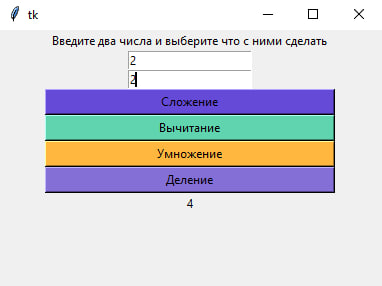
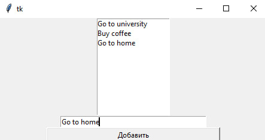
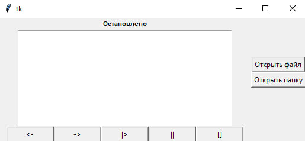
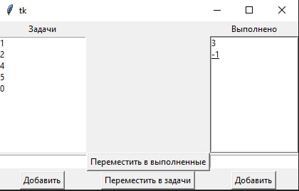

# Python Learning Project

This repository contains solutions to programming exercises and projects focused on learning Python. It specifically covers working with the `tkinter`, `easygui`, and `Pillow` modules. Additionally, it includes a terminal-based game, "Rock, Paper, Scissors," and a collection of basic Python scripts.

## Contents

- **Tkinter exercises**: Projects demonstrating GUI development using the `tkinter` library.
- **EasyGUI exercises**: Simple GUI applications created with the `easygui` module.
- **Pillow exercises**: Image processing tasks and projects using the `Pillow` library.
- **Terminal game**: A command-line "Rock, Paper, Scissors" game implemented in Python.
- **Other python codes**: Basic Python scripts that do not use any external modules.

## Files

1. **`tkinter/`**: Directory containing solutions and examples using the `tkinter` module.
2. **`easygui/`**: Directory with projects built using `easygui`.
3. **`pillow/`**: Directory for image processing tasks using `Pillow`.
4. **`other/`**: Directory containing plain Python scripts without external modules.
5. **`К_5з4у_hedgehog_quest.py`**: Python script for the terminal-based "Rock, Paper, Scissors" game.

## How to Run

1. **Clone the Repository**:
    ```bash
    git clone https://github.com/account_username/repository_name.git
    ```

2. **Navigate to the Project Directory**:
    ```bash
    cd repository_name
    ```

3. **Ensure Required Modules Are Installed**:
    Before running scripts that use external libraries, ensure the necessary Python modules are installed:
    ```bash
    pip install tkinter easygui pillow
    ```

4. **Run the Script**:
    Open the appropriate `.py` file in a text editor or IDE, then run it with Python. For example:
    ```bash
    python3 К_5з4у_hedgehog_quest.py
    ```

## Technologies

- **Python**: The primary programming language for all tasks.
- **Tkinter**: For building graphical user interfaces.
- **EasyGUI**: For simple GUI applications.
- **Pillow**: For image processing.

## Screenshots

### Tkinter Exercise







